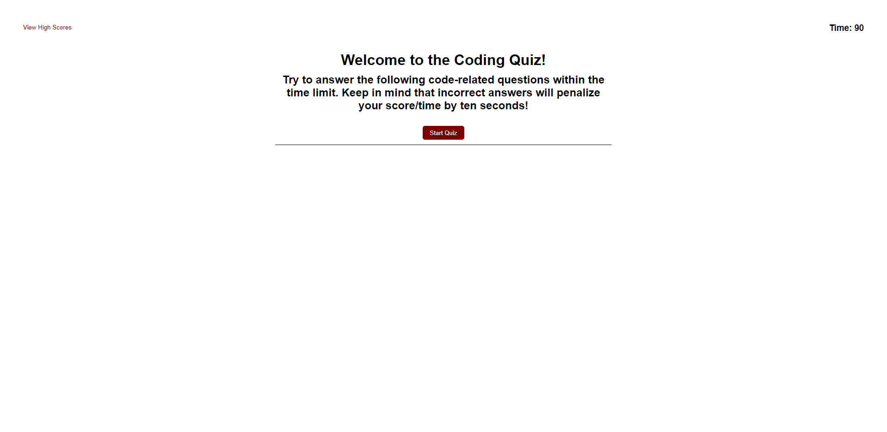

# Code-Quiz

## Purpose
Timed quiz with basic JavaScript questions that decrement if an answer is incorrect. If the timer reaches 0 or the quiz has been completed, the player may then enter their initals along with their score. Scores are stored and persist after the page is closed.

## Project Details
This project was to practice and demonstrate the manipulation of DOM and DOM elements to dynamically remove and generate HTML elements.

## Built With
* HTML
* CSS
* JavaScript

## Website
https://ahmed-sajjad111.github.io/Code-Quiz/

## Preview

## Contribution
Made by [Ahmed Sajjad]